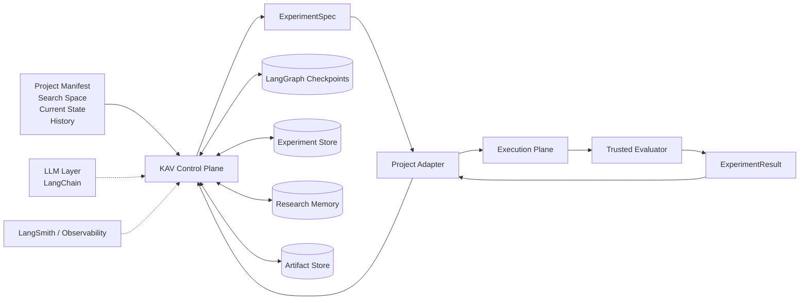
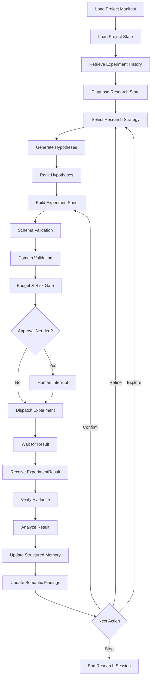
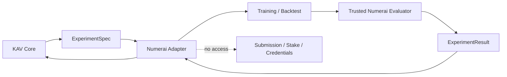

# KAV — Product Vision, Research Architecture, and Development Master Document

> **Status:** Foundational product and architecture document  
> **Version:** 0.1-draft  
> **Date:** 2026-07-21  
> **Product name:** KAV  
> **Tagline:** **Think. Test. Learn.**  
> **Expanded name:** **Knowledge through Adaptive Validation**  
> **Primary language of this document:** Persian, with English technical identifiers  
> **Purpose:** مرجع مادر برای طراحی، پیاده‌سازی، ارزیابی و توسعه‌ی تدریجی KAV

---

## فهرست مطالب

1. [خلاصه‌ی مدیریتی](#1-خلاصه‌ی-مدیریتی)
2. [ریشه‌ی ایده و مسئله‌ی اصلی](#2-ریشه‌ی-ایده-و-مسئله‌ی-اصلی)
3. [تعریف محصول KAV](#3-تعریف-محصول-kav)
4. [هویت و نام محصول](#4-هویت-و-نام-محصول)
5. [چشم‌انداز بلندمدت](#5-چشم‌انداز-بلندمدت)
6. [دامنه‌ی نسخه‌ی اول](#6-دامنه‌ی-نسخه‌ی-اول)
7. [موارد خارج از دامنه‌ی نسخه‌ی اول](#7-موارد-خارج-از-دامنه‌ی-نسخه‌ی-اول)
8. [اصول بنیادین طراحی](#8-اصول-بنیادین-طراحی)
9. [مدل مفهومی دامنه](#9-مدل-مفهومی-دامنه)
10. [نمای کلی معماری](#10-نمای-کلی-معماری)
11. [معماری Control Plane و Execution Plane](#11-معماری-control-plane-و-execution-plane)
12. [نقش LangGraph](#12-نقش-langgraph)
13. [نقش LangChain](#13-نقش-langchain)
14. [نقش LangSmith](#14-نقش-langsmith)
15. [چرخه‌ی کامل پژوهش](#15-چرخه‌ی-کامل-پژوهش)
16. [State Machine پیشنهادی KAV](#16-state-machine-پیشنهادی-kav)
17. [نقش‌های منطقی سیستم](#17-نقشهای-منطقی-سیستم)
18. [قرارداد ProjectManifest](#18-قرارداد-projectmanifest)
19. [قرارداد SearchSpace](#19-قرارداد-searchspace)
20. [قرارداد ExperimentSpec](#20-قرارداد-experimentspec)
21. [قرارداد ExperimentResult](#21-قرارداد-experimentresult)
22. [قرارداد ResearchFinding و Knowledge Memory](#22-قرارداد-researchfinding-و-knowledge-memory)
23. [Research Strategies](#23-research-strategies)
24. [معنای Self-Learning در KAV V1](#24-معنای-self-learning-در-kav-v1)
25. [معماری حافظه و Persistence](#25-معماری-حافظه-و-persistence)
26. [مدیریت توان محاسباتی و اجرای ناهمگام](#26-مدیریت-توان-محاسباتی-و-اجرای-ناهمگام)
27. [Validation، Safety و Governance](#27-validation-safety-و-governance)
28. [معماری Project Adapter](#28-معماری-project-adapter)
29. [روش اتصال به پروژه‌های مختلف](#29-روش-اتصال-به-پروژههای-مختلف)
30. [مطالعه‌ی موردی Numerai](#30-مطالعهی-موردی-numerai)
31. [وضعیت فعلی پروژه‌ی Numerai و شکاف‌ها](#31-وضعیت-فعلی-پروژهی-numerai-و-شکافها)
32. [KAV Numerai Adapter](#32-kav-numerai-adapter)
33. [نمونه‌ی Research Config برای Numerai](#33-نمونهی-research-config-برای-numerai)
34. [نمونه‌ی ExperimentSpec برای Numerai](#34-نمونهی-experimentspec-برای-numerai)
35. [معیارهای ارزیابی در Numerai](#35-معیارهای-ارزیابی-در-numerai)
36. [ساختار پیشنهادی Repository](#36-ساختار-پیشنهادی-repository)
37. [API و CLI پیشنهادی](#37-api-و-cli-پیشنهادی)
38. [مدل داده و جداول اصلی](#38-مدل-داده-و-جداول-اصلی)
39. [Observability و ارزیابی خود KAV](#39-observability-و-ارزیابی-خود-kav)
40. [مدل تهدید و Failure Modes](#40-مدل-تهدید-و-failure-modes)
41. [معیارهای موفقیت نسخه‌ی اول](#41-معیارهای-موفقیت-نسخهی-اول)
42. [Roadmap پیشنهادی](#42-roadmap-پیشنهادی)
43. [تصمیم‌های معماری ثبت‌شده](#43-تصمیمهای-معماری-ثبتشده)
44. [سؤالات باز](#44-سؤالات-باز)
45. [واژه‌نامه](#45-واژهنامه)
46. [منابع و الهام‌ها](#46-منابع-و-الهامها)

---

# 1. خلاصه‌ی مدیریتی

KAV یک **Autonomous Research Orchestrator** عمومی، stateful و domain-agnostic است که به پروژه‌های مختلف متصل می‌شود و وظیفه دارد:

- وضعیت پروژه و تاریخچه‌ی تحقیق را بفهمد؛
- شکاف‌ها و فرصت‌های پژوهشی را تشخیص دهد؛
- فرضیه‌های قابل‌آزمایش تولید کند؛
- برای هر فرضیه یک `ExperimentSpec` دقیق، محدود، معتبر و ماشین‌خوان طراحی کند؛
- اجرای آزمایش را به سیستم میزبان یا Project Adapter بسپارد؛
- نتایج و evidence را دریافت و تحلیل کند؛
- یافته‌های ساختاریافته و قابل‌ردیابی ایجاد کند؛
- و بر اساس شواهد، strategy پژوهش آینده را بهبود دهد.

KAV در نسخه‌ی اول **کد پروژه را مستقیماً ویرایش نمی‌کند**. خروجی اصلی آن `config` و `experiment specification` است. این تصمیم باعث می‌شود سیستم بتواند در حوزه‌های متفاوتی مانند:

- مدل‌سازی مالی و Numerai؛
- forecasting و dynamic pricing؛
- RAG و retrieval optimization؛
- بهینه‌سازی performance نرم‌افزار؛
- simulation؛
- experimentation محصول؛
- و سایر مسائل قابل‌اندازه‌گیری

به‌کار گرفته شود.

معماری KAV از دو سطح اصلی تشکیل می‌شود:

1. **Control Plane**  
   مبتنی بر LangGraph، برای reasoning، state transition، طراحی آزمایش، budget، validation، memory و تصمیم‌گیری.

2. **Execution Plane**  
   متعلق به پروژه‌ی میزبان، برای training، simulation، backtest، evaluation و تولید evidence.

KAV نباید evaluator را کنترل کند و نباید ادعای موفقیت را خودش بسازد. اصل مرکزی سیستم این است:

> **The evaluator is sovereign.**

---

# 2. ریشه‌ی ایده و مسئله‌ی اصلی

الهام اولیه از پروژه‌ی `autoresearch` آندری کارپاتی گرفته شد. ایده‌ی اصلی آن پروژه بسیار ساده و قدرتمند است:

```text
Agent changes a bounded training program
        ↓
Runs a fixed-budget experiment
        ↓
Measures one trusted metric
        ↓
Keeps or discards the change
        ↓
Repeats
```

ارزش اصلی آن پروژه نه در الگوریتم training، بلکه در این الگو است:

- یک محیط آزمایش محدود؛
- یک معیار روشن؛
- یک حلقه‌ی پیوسته؛
- ثبت نتیجه؛
- و انتخاب تغییر بعدی توسط Agent.

اما همان معماری برای KAV کافی نیست، زیرا KAV باید:

- به پروژه‌های متفاوت متصل شود؛
- معیارهای چندگانه داشته باشد؛
- آزمایش‌های پرهزینه و ناهمگام را مدیریت کند؛
- حافظه‌ی بلندمدت داشته باشد؛
- از overfitting به evaluator جلوگیری کند؛
- evidence و lineage را حفظ کند؛
- و از یک config generator ساده فراتر برود.

بنابراین KAV را نباید یک clone از autoresearch دانست. KAV توسعه‌ی مفهومی آن الگو به یک **Research Operating System عمومی** است.

---

# 3. تعریف محصول KAV

تعریف رسمی پیشنهادی:

> **KAV is a stateful, domain-agnostic autonomous research orchestrator that understands project constraints, generates testable hypotheses, designs structured experiments, learns from trusted evidence, and continuously improves its research policy.**

تعریف فارسی:

> **KAV یک هماهنگ‌کننده‌ی خودکار پژوهش است که مستقل از حوزه، با دریافت قرارداد پروژه، فرضیه‌های قابل‌آزمون می‌سازد، آزمایش‌های ساختاریافته طراحی می‌کند، اجرای آن‌ها را به پروژه‌ی میزبان می‌سپارد و از شواهد معتبر برای بهبود مسیر پژوهش آینده یاد می‌گیرد.**

KAV یک مدل ML نیست، یک ابزار AutoML صرف نیست، یک Agent آزاد برای ویرایش repository نیست و یک scheduler محاسباتی هم نیست. KAV در اصل یک **Control Plane برای پژوهش تجربی** است.

---

# 4. هویت و نام محصول

## 4.1 نام

**KAV**

تلفظ: **کاو**

ریشه‌ی مفهومی: از واژه‌ی فارسی **کاویدن**، به معنای جست‌وجوی عمیق، بررسی، کشف و تفحص.

## 4.2 Expanded Name

> **Knowledge through Adaptive Validation**

این expansion عمداً روی سه مفهوم تأکید دارد:

- **Knowledge:** خروجی مطلوب صرفاً score بهتر نیست؛ دانش قابل‌استفاده است.
- **Adaptive:** strategy پژوهش باید بر اساس شواهد تغییر کند.
- **Validation:** هیچ ادعایی بدون آزمایش و evidence پذیرفته نیست.

## 4.3 Tagline

> **Think. Test. Learn.**

## 4.4 معرفی کوتاه برای GitHub

> **KAV is an autonomous research orchestrator for evidence-driven experimentation.**

## 4.5 نام‌های احتمالی اجزای ecosystem

```text
KAV Core
KAV Graph
KAV Memory
KAV SDK
KAV Runner
KAV Studio
KAV Numerai Adapter
KAV RAG Adapter
```

---

# 5. چشم‌انداز بلندمدت

چشم‌انداز KAV ساخت سیستمی است که بتواند در طول زمان از یک planner آزمایش به یک **autonomous research organization** تبدیل شود.

سطوح بلوغ مورد انتظار:

## Level 1 — Structured Experiment Planner

- تولید hypothesis؛
- تولید config؛
- تولید `ExperimentSpec`؛
- تحلیل نتیجه؛
- ثبت memory.

## Level 2 — Adaptive Research Director

- تخصیص budget بر اساس success rate؛
- تغییر search strategy؛
- تشخیص plateau؛
- پیشنهاد confirmation، ablation و combination.

## Level 3 — Controlled Candidate Developer

- تولید patch یا plugin در سطوح مشخص؛
- ایجاد model recipe جدید؛
- تغییر محدود candidate code؛
- بدون دسترسی به evaluator.

## Level 4 — Meta-Research

- مقایسه‌ی research policyها؛
- بهینه‌سازی روش تولید فرضیه؛
- سنجش improvement per compute-hour؛
- یادگیری اینکه چگونه بهتر تحقیق کند.

## Level 5 — Multi-Project Research Network

- انتقال دانش بین پروژه‌های مرتبط؛
- استفاده از patternهای عمومی؛
- ایجاد reusable research priors؛
- حفظ isolation بین داده‌ها و پروژه‌ها.

نسخه‌ی اول فقط بخش مشخصی از Level 1 و پایه‌های Level 2 را پوشش می‌دهد.

---

# 6. دامنه‌ی نسخه‌ی اول

KAV V1 باید قابلیت‌های زیر را داشته باشد:

1. دریافت `ProjectManifest`.
2. دریافت `SearchSpace`.
3. دریافت snapshot وضعیت فعلی پروژه.
4. دسترسی به experiment history.
5. دریافت champion یا baseline فعلی.
6. تشخیص research gap.
7. انتخاب research strategy.
8. تولید چند hypothesis.
9. رتبه‌بندی hypothesisها.
10. تولید `ExperimentSpec` ساختاریافته.
11. schema validation.
12. constraint validation.
13. budget and risk validation.
14. dispatch آزمایش از طریق adapter.
15. دریافت `run_id`.
16. توقف و resume پس از آماده‌شدن نتیجه.
17. دریافت `ExperimentResult`.
18. verify کردن evidence.
19. تحلیل نتیجه و مقایسه با baseline/champion.
20. ثبت structured finding.
21. به‌روزرسانی strategy statistics.
22. انتخاب next action.
23. تکرار چرخه با stop condition مشخص.
24. trace و گزارش قابل‌فهم برای انسان.
25. اجرای local با SQLite.
26. امکان ارتقا به PostgreSQL.
27. امکان استفاده با LLM providerهای مختلف.
28. امکان اتصال Python، HTTP و در آینده MCP.

---

# 7. موارد خارج از دامنه‌ی نسخه‌ی اول

موارد زیر عمداً در V1 پیاده‌سازی نمی‌شوند:

- ویرایش آزاد source code پروژه؛
- commit و merge خودکار؛
- تغییر evaluator؛
- تغییر schema اصلی پروژه توسط Agent؛
- deployment خودکار؛
- promotion خودکار به production؛
- submission مالی خودکار؛
- staking یا معامله؛
- self-modification کد KAV؛
- fine-tune کردن وزن‌های LLM؛
- ساخت خودکار adapter جدید؛
- GPU scheduling داخلی؛
- distributed training engine؛
- multi-agent swarm گسترده؛
- reliance اجباری بر LangSmith Cloud؛
- reliance اجباری بر MCP؛
- دسترسی مستقیم Agent به secretها.

---

# 8. اصول بنیادین طراحی

## 8.1 The Evaluator Is Sovereign

Agent نباید بتواند evaluator، hidden set، scoring logic یا evidence را تغییر دهد.

## 8.2 Every Claim Needs Evidence

هر finding، decision یا promotion proposal باید به experiment و artifact مشخص متصل باشد.

## 8.3 Autonomy Is Bounded

استقلال از طریق contract، search space، budget و policy ایجاد می‌شود؛ نه دسترسی نامحدود.

## 8.4 Experiment Is the Unit of Work

واحد اصلی سیستم prompt، message یا commit نیست؛ `Experiment` است.

## 8.5 Configuration Before Code Mutation

در V1، تغییرات فقط در قالب config و specification انجام می‌شوند.

## 8.6 Separation of Control and Execution

Reasoning و orchestration از training، backtest و simulation جدا هستند.

## 8.7 State Is Not Memory

LangGraph checkpoint، experiment database و semantic memory سه مفهوم جدا هستند.

## 8.8 Structured Data First

Metrics، decisions و experiment identity باید در database ساختاریافته ذخیره شوند. Vector search منبع حقیقت نیست.

## 8.9 Reproducibility by Default

هر experiment باید environment، config، dataset identity، seed، budget و artifact reference داشته باشد.

## 8.10 Human Control at High-Risk Boundaries

Promotion، deployment، submission و capital mutation خارج از اختیار مستقیم KAV هستند.

## 8.11 Cost Is a First-Class Metric

بهبود باید نسبت به compute، زمان و هزینه سنجیده شود.

## 8.12 Negative Results Are Valuable

آزمایش شکست‌خورده حذف نمی‌شود؛ برای جلوگیری از تکرار و تولید دانش نگهداری می‌شود.

---

# 9. مدل مفهومی دامنه

## 9.1 Project

یک سیستم میزبان که مسئله‌ی پژوهشی، search space، evaluator و execution capability دارد.

## 9.2 Research Session

یک campaign پژوهشی با goal، budget و stop condition مشخص.

## 9.3 Hypothesis

یک ادعای قابل‌آزمایش درباره‌ی رابطه‌ی تغییر و نتیجه.

مثال:

> کاهش neutralization از 0.85 به 0.72 ممکن است recent-50 correlation را بهبود دهد، بدون افزایش feature exposure.

## 9.4 ExperimentSpec

تعریف دقیق و ماشین‌خوان یک آزمایش.

## 9.5 ExperimentRun

یک اجرای واقعی از ExperimentSpec در environment مشخص.

ممکن است یک ExperimentSpec چند run داشته باشد، مثلاً برای seedهای مختلف.

## 9.6 ExperimentResult

خروجی ساختاریافته‌ی اجرای آزمایش شامل metrics، artifacts، status و evidence.

## 9.7 Evidence

اطلاعاتی که توسط evaluator یا execution plane تولید شده و برای اثبات نتیجه استفاده می‌شود.

## 9.8 ResearchFinding

دانش استخراج‌شده از یک یا چند experiment با confidence، scope و evidence links.

## 9.9 Candidate

یک configuration یا artifact که ممکن است جایگزین champion شود.

## 9.10 Champion

بهترین configuration یا artifact موردقبول فعلی بر اساس policy پروژه.

## 9.11 Research Strategy

نوع حرکت پژوهشی مانند explore، exploit، ablate یا reproduce.

## 9.12 Research Policy

قواعد تخصیص budget، stop، confirmation، diversity و risk.

---

# 10. نمای کلی معماری

## 10.1 تصویر معماری


> این تصویر یک نسخه‌ی بصری اولیه است. مرجع دقیق معماری، قراردادها و state machineهای همین سند هستند.

## 10.2 Mermaid — نمای ساده



## 10.3 جریان ارزش

```text
Project Knowledge
    ↓
Hypothesis
    ↓
Experiment Design
    ↓
Trusted Execution
    ↓
Evidence
    ↓
Research Finding
    ↓
Better Research Decision
```

---

# 11. معماری Control Plane و Execution Plane

## 11.1 Control Plane

Control Plane در KAV مسئول موارد زیر است:

- خواندن context؛
- reasoning؛
- planning؛
- hypothesis generation؛
- experiment design؛
- validation؛
- budget management؛
- dispatch؛
- waiting/resume؛
- result analysis؛
- memory update؛
- next-action selection.

Control Plane نباید training سنگین را داخل worker خود اجرا کند.

## 11.2 Execution Plane

Execution Plane متعلق به پروژه‌ی میزبان است و ممکن است شامل موارد زیر باشد:

- CPU process؛
- local GPU؛
- remote GPU؛
- cloud job؛
- backtest engine؛
- simulation environment؛
- CI workflow؛
- notebook execution؛
- database query؛
- یا external service.

## 11.3 دلیل جداسازی

- جلوگیری از block شدن graph worker؛
- امکان retry مستقل؛
- پشتیبانی از jobهای طولانی؛
- امنیت evaluator؛
- امکان scaling مستقل؛
- سازگاری با پروژه‌های متفاوت؛
- کاهش coupling.

---

# 12. نقش LangGraph

LangGraph ستون فقرات orchestration KAV است.

## 12.1 قابلیت‌های موردنیاز

- stateful graph؛
- conditional routing؛
- loops؛
- persistence؛
- durable execution؛
- interrupt؛
- resume؛
- subgraph؛
- parallel hypothesis workers؛
- human-in-the-loop؛
- time-travel/debugging؛
- idempotent task execution.

## 12.2 چرا chain خطی کافی نیست؟

چرخه‌ی پژوهش branching دارد:

```text
Result
 ├── confirm
 ├── refine
 ├── explore
 ├── ablate
 ├── reject
 └── stop
```

یک chain ساده نمی‌تواند این transitionها را شفاف و قابل‌کنترل مدیریت کند.

## 12.3 Graph API

برای orchestration اصلی از `StateGraph` استفاده می‌شود.

## 12.4 Task / Functional Concepts

عملیات side-effectدار باید به‌شکل taskهای idempotent اجرا شوند:

- create experiment record؛
- dispatch experiment؛
- update budget؛
- write finding؛
- publish event.

## 12.5 Interrupt

برای approvalهای انسانی:

```text
Generate Spec
    ↓
Validate
    ↓
Risk Level?
    ├── low → dispatch
    ├── medium → policy gate
    └── high → interrupt for human
```

## 12.6 Checkpoint

Checkpoint فقط state اجرای graph را نگه می‌دارد، نه کل دانش پژوهش را.

---

# 13. نقش LangChain

LangChain یک dependency انتخابی و محدود است.

## 13.1 استفاده‌های مناسب

- provider-neutral model initialization؛
- structured output؛
- tool definition؛
- retry policy؛
- model routing؛
- MCP integration؛
- prompt templates.

## 13.2 استفاده‌های نامناسب

- قرار دادن کل KAV در یک `create_agent` عمومی؛
- استفاده از memory agent به‌عنوان database اصلی؛
- دادن command execution آزاد به Agent؛
- استفاده از tool loop بدون stop condition کدنویسی‌شده.

## 13.3 Structured Output

تمام خروجی‌های حساس باید Pydantic-based باشند:

```python
planner = model.with_structured_output(ExperimentSpec)
spec = planner.invoke(prompt)
```

پس از آن:

1. Pydantic validation؛
2. schema validation؛
3. domain validation؛
4. adapter validation؛
5. budget validation؛
6. safety validation.

## 13.4 Model Routing

مدل‌های متفاوت برای وظایف متفاوت:

```text
Cheap model:
- extraction
- summarization
- classification
- duplicate detection

Strong model:
- hypothesis generation
- research diagnosis
- trade-off reasoning

Critic model:
- evidence alignment
- spec review
- result interpretation
```

---

# 14. نقش LangSmith

LangSmith در KAV اختیاری است.

## 14.1 کاربردها

- tracing nodeها؛
- token usage؛
- latency؛
- prompt evaluation؛
- tool-call inspection؛
- debugging trajectory؛
- مقایسه‌ی نسخه‌های prompt؛
- ارزیابی کیفیت hypothesis و ExperimentSpec.

## 14.2 چیزهایی که LangSmith نیست

- experiment database علمی؛
- artifact store؛
- project registry؛
- champion registry؛
- منبع حقیقت metrics.

## 14.3 KAV باید بدون LangSmith اجرا شود

نسخه‌ی open-source باید با logging استاندارد و OpenTelemetry-compatible design قابل‌اجرا باشد.

---

# 15. چرخه‌ی کامل پژوهش



---

# 16. State Machine پیشنهادی KAV

## 16.1 State Schema

```python
class KAVState(TypedDict):
    project_id: str
    research_session_id: str

    manifest_version: str
    project_state_snapshot_id: str

    current_strategy: str | None
    hypothesis_ids: list[str]
    selected_hypothesis_id: str | None

    experiment_spec_id: str | None
    experiment_run_id: str | None
    experiment_status: str | None

    experiment_result_id: str | None
    analysis_id: str | None

    cycle_number: int
    consecutive_failures: int
    plateau_counter: int

    remaining_compute_minutes: float
    remaining_llm_budget: float
    remaining_experiment_count: int

    next_action: str | None
    stop_reason: str | None

    warnings: list[str]
    errors: list[str]
```

## 16.2 Nodeها

1. `load_manifest`
2. `load_project_state`
3. `retrieve_history`
4. `diagnose_research_state`
5. `select_strategy`
6. `generate_hypotheses`
7. `rank_hypotheses`
8. `build_experiment_spec`
9. `validate_schema`
10. `validate_constraints`
11. `estimate_cost`
12. `risk_gate`
13. `approval_gate`
14. `dispatch_experiment`
15. `wait_for_result`
16. `fetch_result`
17. `verify_result`
18. `analyze_result`
19. `write_finding`
20. `update_direction_stats`
21. `choose_next_action`
22. `stop_session`

## 16.3 Stop Conditions

- experiment budget exhausted؛
- compute budget exhausted؛
- LLM budget exhausted؛
- max cycle reached؛
- plateau threshold reached؛
- consecutive failures exceeded؛
- no valid hypothesis؛
- adapter unavailable؛
- evaluator integrity failure؛
- human stop؛
- goal reached.

---

# 17. نقش‌های منطقی سیستم

حتی اگر در V1 یک یا دو LLM call همه‌ی نقش‌ها را اجرا کنند، نقش‌ها باید از نظر مفهومی جدا بمانند.

## 17.1 Research Director

- تشخیص وضعیت پژوهش؛
- انتخاب strategy؛
- تخصیص budget؛
- stop/continue decision.

## 17.2 Scientist

- ساخت hypothesis؛
- استفاده از context و history؛
- پیشنهاد جهت‌های جدید.

## 17.3 Experiment Designer

- تبدیل hypothesis به ExperimentSpec؛
- انتخاب parameterها؛
- تعریف expected effect؛
- تعریف decision rules.

## 17.4 Critic

- بررسی novelty؛
- تشخیص duplication؛
- بررسی testability؛
- تشخیص metric gaming؛
- بررسی ناسازگاری hypothesis و config.

## 17.5 Result Analyst

- تحلیل evidence؛
- تفکیک noise و improvement؛
- بررسی trade-off؛
- پیشنهاد confirmation یا rejection.

## 17.6 Memory Curator

- ساخت finding؛
- تعیین scope؛
- تعیین confidence؛
- ثبت evidence موافق و مخالف.

---

# 18. قرارداد ProjectManifest

`ProjectManifest` توصیف عمومی مسئله است.

## 18.1 اهداف

- ارائه‌ی context دامنه؛
- معرفی artifact؛
- تعریف evaluator؛
- معرفی failure modeها؛
- تعریف actionهای ممنوع؛
- تعریف execution capabilities.

## 18.2 نمونه

```yaml
schema_version: "1.0"

project:
  id: numerai-model-research
  name: Numerai Tournament Model Research
  domain: machine_learning
  problem_type: cross_sectional_financial_prediction
  description: >
    Improve the robustness and live performance of Numerai tournament
    prediction models through structured experimentation.

artifact:
  type: model_bundle
  champion_registry: true
  candidate_registry: true

domain_context:
  important_concepts:
    - eras represent market periods
    - temporal robustness matters more than one aggregate score
    - recent performance can diverge from long-term performance
    - feature exposure can reduce robustness
    - live outcomes are delayed

  common_failure_modes:
    - validation overfitting
    - repeated lockbox reuse
    - lucky-seed promotion
    - high feature exposure
    - correlated ensemble members
    - data leakage
    - evaluator mismatch

protected_capabilities:
  - evaluator
  - hidden_data
  - credentials
  - submission
  - staking
  - production_registry

adapter:
  protocol: python
  version: "1.0"
  capabilities:
    - validate
    - estimate
    - execute
    - status
    - result
    - champion
```

## 18.3 فیلدهای ضروری

- `schema_version`
- `project.id`
- `project.domain`
- `project.problem_type`
- `artifact.type`
- `domain_context`
- `protected_capabilities`
- `adapter.protocol`
- `adapter.capabilities`

---

# 19. قرارداد SearchSpace

SearchSpace باید کاملاً ماشین‌خوان باشد.

## 19.1 انواع پارامتر

- categorical؛
- integer؛
- float؛
- boolean؛
- list؛
- conditional؛
- composite؛
- fixed؛
- derived.

## 19.2 نمونه

```yaml
schema_version: "1.0"

parameters:
  model_family:
    type: categorical
    values:
      - lightgbm
      - xgboost
      - catboost

  learning_rate:
    type: float
    min: 0.003
    max: 0.03
    scale: log

  max_depth:
    type: integer
    min: 3
    max: 8

  feature_set:
    type: categorical
    values:
      - small
      - medium
      - serenity
      - small_serenity

  neutralization:
    type: float
    min: 0.0
    max: 0.9

  target_group:
    type: categorical
    values:
      - primary
      - short_horizon
      - mixed_horizon
      - broad_horizon

conditions:
  - if:
      model_family: lightgbm
    allow:
      - num_leaves
      - colsample_bytree

  - if:
      model_family: catboost
    allow:
      - depth
      - l2_leaf_reg

forbidden_combinations:
  - feature_set: all
    max_depth:
      gt: 7
```

## 19.3 SearchSpace فقط range نیست

باید شامل موارد زیر هم باشد:

- priorهای پیشنهادی؛
- default؛
- cost model؛
- compatibility constraints؛
- known unsafe regions؛
- deprecated values؛
- domain notes.

---

# 20. قرارداد ExperimentSpec

ExperimentSpec خروجی اصلی KAV V1 است.

## 20.1 ویژگی‌ها

- دقیق؛
- deterministic تا حد ممکن؛
- قابل‌اعتبارسنجی؛
- قابل‌بازتولید؛
- متصل به hypothesis؛
- دارای budget؛
- دارای expected effect؛
- دارای decision rule.

## 20.2 Schema پیشنهادی

```yaml
schema_version: "1.0"

experiment:
  id: exp_2026_07_001
  project_id: numerai-model-research
  research_session_id: rs_2026_07_01
  parent_experiment_ids:
    - exp_2026_06_018
  strategy: refine
  priority: medium

hypothesis:
  id: hyp_2026_07_011
  statement: >
    Combining small and serenity feature families with moderate
    neutralization may improve recent-regime stability without
    increasing feature exposure.
  rationale:
    - Serenity candidates showed lower drawdown.
    - Small features produced stronger broad correlation.
    - Neutralization above 0.85 harmed recent-50 in prior runs.
  expected_mechanism: >
    Feature-family diversification may reduce regime-specific variance
    while moderate neutralization controls exposure.
  confidence_before_run: medium

configuration:
  model_family: lightgbm
  feature_set:
    - small
    - serenity
  parameters:
    n_estimators: 2000
    learning_rate: 0.008
    max_depth: 5
    num_leaves: 31
    colsample_bytree: 0.10
    random_state: 123
  neutralization: 0.72

evaluation:
  protocol: walk_forward_v1
  compare_against:
    type: champion
    id: champion_current
  required_metrics:
    - validation_corr
    - sharpe
    - max_drawdown
    - feature_exposure
    - recent_25_corr
    - recent_50_corr
    - recent_100_corr
  confirmation:
    required_runs: 2
    different_seeds: true

budget:
  max_runtime_minutes: 45
  max_memory_gb: 12
  max_estimated_cost_usd: 3.0

expected_result:
  primary_metric: validation_corr
  minimum_expected_delta: 0.0001
  expected_tradeoffs:
    recent_50_corr: improve
    feature_exposure: not_increase
    max_drawdown: not_increase

decision_rules:
  accept_for_confirmation:
    validation_corr_delta:
      min: 0.0001
    recent_50_corr:
      min: 0.0
    feature_exposure:
      max: 0.1
  reject_if:
    - evaluator_integrity_failed
    - artifact_missing
    - non_reproducible
```

## 20.3 ExperimentSpec نباید شامل secret باشد

- API key؛
- credential path؛
- production token؛
- hidden label؛
- stake amount.

---

# 21. قرارداد ExperimentResult

ExperimentResult باید فقط توسط adapter و evaluator تولید شود.

## 21.1 نمونه

```yaml
schema_version: "1.0"

run:
  id: run_2026_07_001_01
  experiment_id: exp_2026_07_001
  status: completed
  started_at: "2026-07-21T10:00:00Z"
  finished_at: "2026-07-21T10:37:00Z"

identity:
  project_version: "git:abc123"
  adapter_version: "1.0.0"
  evaluator_version: "numerai-eval-2.1"
  dataset_version: "v5.3"
  environment_hash: "sha256:..."
  config_hash: "sha256:..."

resources:
  runtime_seconds: 2220
  peak_memory_gb: 9.4
  compute_type: cpu
  estimated_cost_usd: 0.8

metrics:
  validation_corr: 0.01031
  validation_corr_delta: 0.00017
  sharpe: 0.712
  max_drawdown: 0.137
  feature_exposure: 0.089
  recent_25_corr: 0.0042
  recent_50_corr: 0.0008
  recent_100_corr: 0.0026

artifacts:
  - type: model_bundle
    uri: artifact://models/run_2026_07_001_01.pkl
    sha256: "..."
  - type: evaluation_report
    uri: artifact://reports/run_2026_07_001_01.json
    sha256: "..."
  - type: log
    uri: artifact://logs/run_2026_07_001_01.log
    sha256: "..."

evidence:
  evaluator_passed: true
  integrity_passed: true
  metric_schema_passed: true
  artifact_hashes_verified: true

warnings:
  - lockbox improvement is small

errors: []
```

## 21.2 Result Statusها

- queued؛
- running؛
- completed؛
- failed؛
- timed_out؛
- cancelled؛
- invalid؛
- evaluator_failed؛
- integrity_failed.

---

# 22. قرارداد ResearchFinding و Knowledge Memory

## 22.1 Finding باید evidence-linked باشد

```yaml
finding:
  id: finding_2026_07_045
  project_id: numerai-model-research

  statement: >
    Moderate neutralization between 0.65 and 0.78 appears more robust
    for small+serenity LightGBM ensembles than values above 0.85.

  scope:
    model_family: lightgbm
    feature_set:
      - small
      - serenity

  confidence: medium

  supporting_experiments:
    - exp_014
    - exp_021
    - exp_029

  contradicting_experiments:
    - exp_017

  evidence_summary:
    supporting_count: 3
    contradicting_count: 1
    mean_primary_delta: 0.00022

  applicability:
    - numerai
    - feature_family_ensemble

  created_by:
    component: memory_curator
    model: configured-critic-model
```

## 22.2 Finding نباید حقیقت قطعی تلقی شود

هر finding باید:

- confidence داشته باشد؛
- scope داشته باشد؛
- evidence مخالف را حفظ کند؛
- قابل‌منسوخ‌شدن باشد؛
- تاریخ تولید داشته باشد.

---

# 23. Research Strategies

KAV باید strategy را صریح انتخاب کند.

## 23.1 Explore

امتحان یک جهت متفاوت.

## 23.2 Exploit

تنظیم دقیق جهت موفق.

## 23.3 Refine

بهبود config نزدیک به یک candidate promising.

## 23.4 Ablate

حذف جزء برای فهم علت موفقیت.

## 23.5 Combine

ترکیب دو یا چند near-miss.

## 23.6 Reproduce

تکرار نتیجه‌ی خوب برای اطمینان.

## 23.7 Confirm

اجرای confirmation با seed یا fold متفاوت.

## 23.8 Challenge

طراحی آزمایش برای شکستن champion یا یافتن ضعف آن.

## 23.9 Simplify

کاهش هزینه یا پیچیدگی با حفظ performance.

## 23.10 Recover

تغییر جهت بعد از plateau یا failure متوالی.

## 23.11 Monitor

آزمایش جدید تولید نمی‌کند؛ فقط evidence تازه را تحلیل می‌کند.

---

# 24. معنای Self-Learning در KAV V1

KAV V1 مدل خود را fine-tune نمی‌کند. یادگیری آن از طریق تغییر state و policy اتفاق می‌افتد.

## 24.1 Parameter Learning

تشخیص نواحی promising در search space.

## 24.2 Direction Learning

محاسبه‌ی success rate و compute efficiency برای خانواده‌های فرضیه.

```yaml
direction_stats:
  feature_selection:
    experiments: 18
    success_rate: 0.28
    average_primary_delta: 0.00034
    improvement_per_compute_hour: 0.00021

  hyperparameter_tuning:
    experiments: 31
    success_rate: 0.06
    average_primary_delta: 0.00004
    improvement_per_compute_hour: 0.00001
```

## 24.3 Conceptual Learning

تولید findingهای evidence-linked.

## 24.4 Policy Adaptation

مثال:

```text
Hyperparameter tuning saturated
        ↓
Reduce budget for exploit
        ↓
Increase budget for feature exploration
```

## 24.5 Meta-Evaluation

KAV باید بعدها بتواند کیفیت policy خود را با معیارهای زیر بسنجد:

- improvement per experiment؛
- improvement per compute-hour؛
- invalid spec rate؛
- duplicate experiment rate؛
- confirmation success rate؛
- hypothesis novelty؛
- false discovery rate؛
- time to useful finding.

---

# 25. معماری حافظه و Persistence

## 25.1 LangGraph Checkpoints

برای:

- resume؛
- current node؛
- graph state؛
- interrupt context.

## 25.2 Experiment Store

منبع حقیقت ساختاریافته:

- projects؛
- sessions؛
- hypotheses؛
- specs؛
- runs؛
- metrics؛
- decisions؛
- champions؛
- findings.

## 25.3 Artifact Store

برای:

- model file؛
- config file؛
- logs؛
- reports؛
- predictions؛
- charts؛
- environment snapshot.

## 25.4 Semantic Memory

برای retrieval مفهومی:

- خلاصه‌ی یافته‌ها؛
- failure patterns؛
- unresolved questions؛
- rationale؛
- domain notes.

## 25.5 اصل مهم

> Database query برای fact، semantic retrieval برای context.

مثال:

```sql
SELECT *
FROM experiment_runs
WHERE project_id = :project_id
  AND status = 'completed'
ORDER BY primary_metric_delta DESC
LIMIT 20;
```

---

# 26. مدیریت توان محاسباتی و اجرای ناهمگام

LangGraph compute engine نیست.

## 26.1 الگوی execution

```text
KAV creates ExperimentSpec
        ↓
Adapter validates and estimates
        ↓
Adapter submits external job
        ↓
Returns run_id
        ↓
KAV enters WAITING state
        ↓
Job completes
        ↓
Adapter returns ExperimentResult
        ↓
KAV resumes
```

## 26.2 روش‌های execution

- local subprocess؛
- Python worker؛
- Celery/RQ؛
- Kubernetes Job؛
- GitHub Actions؛
- cloud ML job؛
- SLURM؛
- serverless job؛
- external API.

## 26.3 Polling vs Callback

V1 می‌تواند polling داشته باشد:

```text
status(run_id)
```

بعداً callback/event-driven:

```text
experiment.completed
experiment.failed
```

## 26.4 Idempotency

`dispatch_experiment` باید idempotency key داشته باشد.

```text
idempotency_key = hash(project_id + experiment_spec_id + config_hash)
```

## 26.5 Budget Types

- wall-clock budget؛
- CPU/GPU minutes؛
- memory limit؛
- cloud cost؛
- LLM token cost؛
- max parallel runs؛
- daily experiment count.

---

# 27. Validation، Safety و Governance

## 27.1 Validation Layers

1. Pydantic/schema validation.
2. Search-space validation.
3. Conditional constraint validation.
4. Domain validation.
5. Duplicate detection.
6. Cost estimation.
7. Safety validation.
8. Adapter validation.
9. Evaluator integrity validation.

## 27.2 Risk Levels

### Low Risk

- config داخل range؛
- هزینه پایین؛
- بدون production impact؛
- auto-dispatch مجاز.

### Medium Risk

- هزینه متوسط؛
- تغییر بزرگ در search space؛
- policy approval.

### High Risk

- compute گران؛
- external side effect؛
- production impact؛
- human interrupt.

## 27.3 Protected Surfaces

- evaluator؛
- hidden data؛
- production registry؛
- credentials؛
- submission؛
- capital allocation؛
- deployment؛
- audit logs.

## 27.4 Promotion

KAV فقط proposal تولید می‌کند.

```text
Candidate
   ↓
Independent verification
   ↓
Promotion proposal
   ↓
Human/governance approval
   ↓
Production
```

---

# 28. معماری Project Adapter

## 28.1 Interface مفهومی

```python
class ResearchProjectAdapter(Protocol):
    def describe_project(self) -> ProjectManifest:
        ...

    def get_current_state(self) -> ProjectState:
        ...

    def get_search_space(self) -> SearchSpace:
        ...

    def get_champion(self) -> Candidate | None:
        ...

    def validate_experiment(
        self,
        experiment: ExperimentSpec,
    ) -> ValidationResult:
        ...

    def estimate_experiment(
        self,
        experiment: ExperimentSpec,
    ) -> CostEstimate:
        ...

    def execute_experiment(
        self,
        experiment: ExperimentSpec,
        idempotency_key: str,
    ) -> ExperimentRun:
        ...

    def get_experiment_status(
        self,
        run_id: str,
    ) -> ExperimentStatus:
        ...

    def get_experiment_result(
        self,
        run_id: str,
    ) -> ExperimentResult:
        ...
```

## 28.2 Transportها

- In-process Python؛
- CLI؛
- HTTP؛
- message queue؛
- MCP اختیاری.

## 28.3 چرا MCP قرارداد اصلی نیست؟

زیرا:

- پروژه‌ی ساده نباید مجبور به ساخت MCP server شود؛
- transport نباید با domain contract یکی شود؛
- Python adapter برای شروع ساده‌تر است؛
- HTTP برای deployment عمومی مناسب است؛
- MCP قابلیت اضافه است، نه هویت اصلی.

---

# 29. روش اتصال به پروژه‌های مختلف

## 29.1 Machine Learning

- config: model، features، targets، hyperparameters؛
- execute: train؛
- result: metrics و artifact.

## 29.2 RAG

- config: chunking، embedding، retriever، reranker، prompt؛
- execute: evaluation pipeline؛
- metrics: Recall@k، nDCG، faithfulness، citation precision، latency، cost.

## 29.3 Software Performance

- config: concurrency، cache، query strategy، compiler flags؛
- execute: benchmark؛
- metrics: latency، throughput، error rate، memory.

## 29.4 Forecasting

- config: lagها، features، model، horizon، loss؛
- execute: rolling validation؛
- metrics: WMAPE، MASE، bias، stability، business impact.

## 29.5 Product Experiments

- config: treatment؛
- execute: simulation یا A/B platform؛
- result: conversion، retention، statistical confidence.

در پروژه‌هایی که نتیجه delayed است، KAV باید distinction بین:

- offline evidence؛
- shadow evidence؛
- live evidence

را حفظ کند.

---

# 30. مطالعه‌ی موردی Numerai

Numerai نخستین integration واقعی و جدی KAV است.

هدف:

> طراحی یک حلقه‌ی تحقیق و توسعه‌ی پیوسته برای بهبود مدل‌های Numerai، بدون دادن اختیار submission یا staking به KAV.

## 30.1 Mutable Surfaces

- model family؛
- hyperparameters؛
- feature family combinations؛
- target groups؛
- neutralization level؛
- ensemble composition؛
- ensemble weights؛
- sampling strategy؛
- seed؛
- confirmation settings.

## 30.2 Protected Surfaces

- evaluator؛
- hidden/lockbox data؛
- Numerai credentials؛
- submission guard؛
- staking؛
- production registry؛
- model slot mapping؛
- live approval workflow.

## 30.3 Artifact

- immutable model bundle؛
- prediction function؛
- feature declaration؛
- evaluation packet؛
- checksums؛
- manifest.

---

# 31. وضعیت فعلی پروژه‌ی Numerai و شکاف‌ها

بررسی repository `numerai-tournament-bot` نشان داد:

## 31.1 Branch اصلی

`main` یک baseline ساده دارد:

- LightGBM ثابت؛
- feature set کوچک؛
- هر چهارمین era؛
- validation جدا؛
- CORR، Sharpe و Max Drawdown؛
- بدون research loop.

## 31.2 Branch پیشرفته

`codex/agentic-winning-os` شامل:

- multi-model suite؛
- LightGBM، XGBoost، CatBoost؛
- feature engineering؛
- ensemble؛
- robustness packet؛
- promotion policy؛
- model registry؛
- shadow deployment؛
- governance؛
- scheduler؛
- optimizerهای محدود.

## 31.3 Sweepهای فعلی

- seed × neutralization؛
- target ensemble؛
- feature-family ensemble.

## 31.4 شکاف اصلی

optimizerها hard-coded هستند و research scheduler فقط artifact موجود را evaluate می‌کند. در نتیجه سیستم فعلی:

> Automated evaluation + manually designed bounded experiments

است، نه autonomous research.

## 31.5 مشکلات فنی مهم

- evaluator mismatch بین Pearson ساده و Numerai scoring؛
- FNC placeholder؛
- walk-forward موجود ولی متصل‌نشده؛
- champion comparison در بعضی مسیرها با `champion=None`؛
- lockbox reuse risk؛
- downsampling ثابت با stride=4؛
- bug در ModelAgent؛
- data version hard-coded؛
- optimizer به scheduler متصل نیست.

این موارد باید قبل از اتصال کامل KAV اصلاح یا isolate شوند.

---

# 32. KAV Numerai Adapter

## 32.1 مسئولیت‌ها

- معرفی manifest؛
- معرفی search space؛
- خواندن champion؛
- خواندن history؛
- validation config؛
- cost estimation؛
- اجرای experiment؛
- استفاده از trusted evaluator؛
- ثبت artifact؛
- return result.

## 32.2 نباید انجام دهد

- submission؛
- staking؛
- تغییر production؛
- تغییر evaluator؛
- بازکردن hidden labels برای KAV.

## 32.3 Architecture



---

# 33. نمونه‌ی Research Config برای Numerai

```yaml
project:
  id: numerai-model-research
  domain: machine_learning

goal:
  description: >
    Improve Numerai tournament model robustness and live usefulness.
  primary_objective:
    metric: numerai_corr
    direction: maximize

secondary_objectives:
  - sharpe
  - mmc
  - feature_neutral_corr
  - recent_50_corr
  - max_drawdown
  - feature_exposure
  - compute_cost

search_space:
  model_family:
    type: categorical
    values:
      - lightgbm
      - xgboost
      - catboost

  feature_set:
    type: categorical
    values:
      - small
      - medium
      - serenity
      - small_serenity

  learning_rate:
    type: float
    min: 0.003
    max: 0.03
    scale: log

  max_depth:
    type: integer
    min: 3
    max: 8

  neutralization:
    type: float
    min: 0.0
    max: 0.9

constraints:
  max_feature_exposure: 0.1
  max_drawdown: 0.25
  max_runtime_minutes: 90
  max_memory_gb: 14

research_policy:
  max_parallel_experiments: 1
  max_daily_compute_minutes: 240
  max_experiments_per_session: 8
  confirmation_runs: 2
  require_human_approval_for_promotion: true
  allow_submission: false
  allow_staking: false
```

---

# 34. نمونه‌ی ExperimentSpec برای Numerai

```yaml
experiment:
  id: exp_numerai_0001
  strategy: combine
  parent_experiment_ids:
    - exp_feature_small
    - exp_feature_serenity

hypothesis:
  statement: >
    A ranked ensemble of small and serenity feature-family models,
    with neutralization near 0.72, improves recent regime stability
    while maintaining broad historical correlation.
  rationale:
    - small features have stronger aggregate correlation
    - serenity features have shown lower drawdown
    - high neutralization has harmed recent performance
  confidence_before_run: medium

configuration:
  model_family: lightgbm
  feature_families:
    - small
    - serenity
  ensemble_method: era_rank_mean
  parameters:
    n_estimators: 2000
    learning_rate: 0.008
    max_depth: 5
    num_leaves: 31
    colsample_bytree: 0.1
    seed: 123
  neutralization: 0.72
  training_era_stride: 4

evaluation:
  protocol: numerai_walk_forward_v1
  development_folds: true
  rolling_lockbox: true
  sealed_final_lockbox: false
  compare_against: champion
  metrics:
    - numerai_corr
    - sharpe
    - max_drawdown
    - feature_exposure
    - fnc
    - mmc
    - recent_25_corr
    - recent_50_corr
    - recent_100_corr

budget:
  max_runtime_minutes: 60
  max_memory_gb: 12

confirmation:
  required_if_promising: true
  full_era_training: true
  seeds:
    - 42
    - 123
```

---

# 35. معیارهای ارزیابی در Numerai

KAV نباید یک score واحد را کورکورانه optimize کند.

## 35.1 Primary

- official Numerai CORR یا evaluator موردتأیید پروژه.

## 35.2 Secondary

- Sharpe؛
- Smart Sharpe در صورت تعریف معتبر؛
- Max Drawdown؛
- Hit Rate؛
- Recent 25/50/100؛
- Feature Exposure؛
- FNC؛
- MMC؛
- regime stability؛
- bootstrap interval؛
- paired difference vs champion؛
- model diversity؛
- prediction correlation؛
- runtime؛
- memory؛
- artifact complexity.

## 35.3 Multi-Objective Decision

Promotion فقط با بالاترین CORR انجام نمی‌شود.

مثال:

```text
Candidate A:
+0.00020 CORR
+0.03 exposure
higher drawdown

Candidate B:
+0.00012 CORR
lower exposure
lower drawdown
lower compute cost
```

ممکن است Candidate B انتخاب بهتری باشد.

## 35.4 Evaluation Layers

```text
Development folds
        ↓
Validation gate
        ↓
Rolling pseudo-lockbox
        ↓
Sealed final lockbox
        ↓
Shadow live evidence
        ↓
Production consideration
```

---

# 36. ساختار پیشنهادی Repository

```text
kav/
├── README.md
├── pyproject.toml
├── LICENSE
├── docs/
│   ├── architecture.md
│   ├── contracts.md
│   ├── adapter-guide.md
│   ├── security.md
│   └── examples/
│
├── src/kav/
│   ├── core/
│   │   ├── graph.py
│   │   ├── orchestrator.py
│   │   ├── research_director.py
│   │   ├── hypothesis_engine.py
│   │   ├── experiment_planner.py
│   │   ├── result_analyst.py
│   │   └── decision_engine.py
│   │
│   ├── contracts/
│   │   ├── project_manifest.py
│   │   ├── search_space.py
│   │   ├── hypothesis.py
│   │   ├── experiment_spec.py
│   │   ├── experiment_result.py
│   │   ├── finding.py
│   │   └── adapter.py
│   │
│   ├── memory/
│   │   ├── experiment_store.py
│   │   ├── artifact_store.py
│   │   ├── knowledge_store.py
│   │   ├── retrieval.py
│   │   └── models.py
│   │
│   ├── search/
│   │   ├── sampler.py
│   │   ├── random_search.py
│   │   ├── bayesian_search.py
│   │   ├── bandit_policy.py
│   │   ├── diversity.py
│   │   └── duplicate_detector.py
│   │
│   ├── validation/
│   │   ├── schema_validator.py
│   │   ├── constraint_validator.py
│   │   ├── domain_validator.py
│   │   ├── budget_validator.py
│   │   └── risk_gate.py
│   │
│   ├── providers/
│   │   ├── llm.py
│   │   ├── embeddings.py
│   │   └── model_router.py
│   │
│   ├── adapters/
│   │   ├── base.py
│   │   ├── python_adapter.py
│   │   ├── http_adapter.py
│   │   └── mcp_adapter.py
│   │
│   ├── api/
│   │   ├── app.py
│   │   ├── routes.py
│   │   └── schemas.py
│   │
│   ├── cli/
│   │   └── main.py
│   │
│   └── observability/
│       ├── logging.py
│       ├── tracing.py
│       └── metrics.py
│
├── migrations/
├── tests/
│   ├── unit/
│   ├── integration/
│   ├── contract/
│   └── fixtures/
│
└── examples/
    ├── toy-optimizer/
    ├── numerai/
    ├── forecasting/
    └── rag/
```

## 36.1 Adapter داخل پروژه‌ی میزبان

```text
numerai-tournament-bot/
└── kav/
    ├── adapter.py
    ├── manifest.yaml
    ├── search_space.yaml
    ├── evaluator_contract.yaml
    └── experiment_runner.py
```

---

# 37. API و CLI پیشنهادی

## 37.1 CLI

```bash
kav project validate ./kav/manifest.yaml
kav project inspect numerai-model-research
kav session start numerai-model-research
kav session status SESSION_ID
kav session stop SESSION_ID
kav experiment propose SESSION_ID
kav experiment validate EXPERIMENT_SPEC_ID
kav experiment dispatch EXPERIMENT_SPEC_ID
kav experiment status RUN_ID
kav experiment result RUN_ID
kav memory findings numerai-model-research
```

## 37.2 HTTP API

```text
POST   /projects
GET    /projects/{project_id}
POST   /projects/{project_id}/validate
POST   /research-sessions
GET    /research-sessions/{session_id}
POST   /research-sessions/{session_id}/step
POST   /research-sessions/{session_id}/stop
GET    /experiments/{experiment_id}
POST   /experiments/{experiment_id}/dispatch
GET    /runs/{run_id}
GET    /runs/{run_id}/result
GET    /projects/{project_id}/findings
GET    /projects/{project_id}/champion
```

## 37.3 Eventها

```text
research.session.started
hypothesis.generated
experiment.spec.created
experiment.validation.failed
experiment.dispatched
experiment.completed
experiment.failed
finding.created
candidate.proposed
research.session.stopped
```

---

# 38. مدل داده و جداول اصلی

## 38.1 projects

- id
- name
- domain
- manifest_version
- adapter_type
- created_at
- updated_at

## 38.2 research_sessions

- id
- project_id
- goal
- status
- cycle_number
- compute_budget
- llm_budget
- started_at
- stopped_at
- stop_reason

## 38.3 hypotheses

- id
- session_id
- statement
- rationale
- strategy
- confidence
- status
- created_at

## 38.4 experiment_specs

- id
- hypothesis_id
- spec_json
- config_hash
- validation_status
- estimated_cost
- risk_level
- created_at

## 38.5 experiment_runs

- id
- experiment_spec_id
- external_run_id
- status
- environment_hash
- started_at
- finished_at
- runtime_seconds
- cost

## 38.6 metrics

- run_id
- metric_name
- value
- direction
- scope
- is_primary

## 38.7 artifacts

- id
- run_id
- type
- uri
- sha256
- size
- metadata

## 38.8 decisions

- id
- session_id
- run_id
- decision
- rationale
- next_action
- created_at

## 38.9 findings

- id
- project_id
- statement
- confidence
- scope_json
- supporting_ids
- contradicting_ids
- status
- created_at

## 38.10 direction_stats

- project_id
- direction
- experiment_count
- success_count
- average_delta
- compute_hours
- efficiency_score

## 38.11 champions

- project_id
- candidate_id
- effective_at
- retired_at
- approval_reference

---

# 39. Observability و ارزیابی خود KAV

## 39.1 Operational Metrics

- session success rate؛
- node latency؛
- LLM latency؛
- tool error rate؛
- dispatch failure؛
- resume failure؛
- invalid spec rate؛
- adapter error rate.

## 39.2 Research Quality Metrics

- valid hypothesis rate؛
- duplicate hypothesis rate؛
- testable hypothesis rate؛
- promising experiment rate؛
- confirmation success rate؛
- improvement per compute-hour؛
- finding reuse rate؛
- plateau recovery rate.

## 39.3 LLM Evaluation Dataset

Input:

- ProjectManifest؛
- current state؛
- history؛
- budget.

Expected:

- valid hypothesis؛
- bounded ExperimentSpec؛
- correct rationale؛
- no forbidden action.

Evaluatorها:

- schema validity؛
- novelty؛
- evidence alignment؛
- search-space compliance؛
- budget compliance؛
- testability؛
- duplication؛
- safety.

---

# 40. مدل تهدید و Failure Modes

## 40.1 Metric Gaming

Agent configی پیشنهاد می‌دهد که evaluator را دور می‌زند.

راهکار:

- evaluator جدا؛
- hidden data؛
- integrity hash؛
- rule-based validation.

## 40.2 Lockbox Overfitting

نتایج lockbox بارها برای تصمیم‌گیری استفاده می‌شوند.

راهکار:

- rolling pseudo-lockbox؛
- sealed final lockbox؛
- limited access؛
- live shadow evidence.

## 40.3 Duplicate Experiments

KAV آزمایش قبلی را دوباره پیشنهاد می‌دهد.

راهکار:

- canonical config hash؛
- similarity detection؛
- explicit reproduce strategy.

## 40.4 Hallucinated Parameters

LLM پارامتر نامعتبر می‌سازد.

راهکار:

- structured output؛
- search-space validator؛
- adapter validator.

## 40.5 Cost Explosion

آزمایش گران یا بی‌نهایت.

راهکار:

- hard budget؛
- max cycles؛
- max parallelism؛
- cost estimate؛
- stop conditions.

## 40.6 Self-Confirmation Bias

همان مدل hypothesis را می‌سازد و نتیجه را تأیید می‌کند.

راهکار:

- role separation؛
- critic؛
- rule engine؛
- trusted metrics؛
- optional different model for review.

## 40.7 Memory Contamination

یک finding ضعیف به‌عنوان حقیقت استفاده می‌شود.

راهکار:

- confidence؛
- scope؛
- evidence links؛
- contradicting evidence؛
- expiry/review.

## 40.8 Adapter Drift

پروژه یا evaluator تغییر می‌کند.

راهکار:

- adapter version؛
- evaluator version؛
- contract tests؛
- compatibility check.

## 40.9 Partial Failure

job اجرا می‌شود ولی result ثبت نمی‌شود.

راهکار:

- idempotency؛
- external run ID؛
- reconciliation؛
- retry status fetch.

## 40.10 Sensitive Data Leakage

context یا artifact حاوی secret وارد prompt می‌شود.

راهکار:

- redaction؛
- allowlist؛
- no-secret contract؛
- local deployment option.

---

# 41. معیارهای موفقیت نسخه‌ی اول

V1 زمانی قابل‌قبول است که:

## 41.1 Functional

- یک toy project را register کند؛
- manifest را validate کند؛
- hypothesis بسازد؛
- ExperimentSpec معتبر بسازد؛
- adapter آزمایش را اجرا کند؛
- graph منتظر بماند و resume شود؛
- نتیجه را تحلیل کند؛
- finding ثبت کند؛
- آزمایش بعدی را انتخاب کند.

## 41.2 Reliability

- crash recovery؛
- duplicate dispatch prevention؛
- deterministic record identity؛
- adapter contract tests؛
- no lost experiment result.

## 41.3 Safety

- Agent نتواند protected capability را فراخوانی کند؛
- invalid config اجرا نشود؛
- budget enforce شود؛
- evaluator integrity failure session را متوقف کند.

## 41.4 Generality

حداقل دو adapter متفاوت:

1. toy numeric optimizer؛
2. Numerai یا forecasting.

## 41.5 Quality

- بیش از 95٪ specها schema-valid؛
- duplicate accidental کمتر از 5٪؛
- تمام findingها evidence-linked؛
- تمام runها reproducible identity داشته باشند.

---

# 42. Roadmap پیشنهادی

## Phase 0 — Product Specification

- تثبیت این سند؛
- تعریف scope؛
- ثبت ADRها؛
- انتخاب license؛
- ایجاد repository.

## Phase 1 — Contracts

- Pydantic schemas؛
- manifest؛
- search space؛
- spec؛
- result؛
- adapter protocol؛
- contract tests.

## Phase 2 — Minimal Graph

- LangGraph state؛
- load context؛
- hypothesis generation؛
- spec generation؛
- validation؛
- mock dispatch؛
- result analysis.

## Phase 3 — Persistence

- SQLite؛
- checkpoints؛
- experiment store؛
- artifact references؛
- findings.

## Phase 4 — Toy Adapter

یک مسئله‌ی ساده مانند optimize کردن تابع مصنوعی:

```text
Goal: maximize score
Config: x, y, strategy
Evaluator: hidden deterministic function
```

این adapter برای تست self-learning و strategy مناسب است.

## Phase 5 — Numerai Adapter Read-Only

- manifest؛
- search space؛
- history import؛
- candidate config generation؛
- evaluator integration؛
- بدون dispatch live.

## Phase 6 — Numerai Offline Execution

- training؛
- validation؛
- result؛
- artifact store؛
- confirmation runs.

## Phase 7 — Research Policy Adaptation

- direction stats؛
- bandit allocation؛
- plateau detection؛
- explore/exploit balance.

## Phase 8 — API and Service Mode

- FastAPI؛
- background worker؛
- polling/callback؛
- authentication؛
- project isolation.

## Phase 9 — Open Source Readiness

- documentation؛
- examples؛
- contribution guide؛
- security policy؛
- semantic versioning؛
- release automation.

## Phase 10 — Advanced Capabilities

- MCP adapter؛
- multi-agent roles؛
- patch generation capability؛
- meta-research؛
- KAV Studio UI.

---

# 43. تصمیم‌های معماری ثبت‌شده

## ADR-001 — نام محصول

**Decision:** KAV  
**Meaning:** Knowledge through Adaptive Validation  
**Tagline:** Think. Test. Learn.

## ADR-002 — دامنه‌ی V1

**Decision:** فقط config و ExperimentSpec تولید شود.  
**Reason:** generality، safety و کاهش coupling.

## ADR-003 — Orchestration

**Decision:** LangGraph StateGraph.  
**Reason:** state، loops، branching، persistence، interrupt و resume.

## ADR-004 — LangChain

**Decision:** استفاده‌ی محدود برای model abstraction و structured output.  
**Rejected:** یک generic create_agent برای کل سیستم.

## ADR-005 — Execution

**Decision:** training و compute خارج از graph process.

## ADR-006 — Adapter Contract

**Decision:** قرارداد اصلی Python/HTTP-neutral باشد.  
**MCP:** optional transport.

## ADR-007 — Persistence

**Decision:** checkpoint، experiment store و semantic memory جدا باشند.

## ADR-008 — Truth Source

**Decision:** evaluator و structured experiment store منبع حقیقت هستند.

## ADR-009 — Promotion

**Decision:** KAV فقط proposal می‌دهد؛ production mutation خارج از scope.

## ADR-010 — Numerai

**Decision:** اولین integration جدی، با research-only permissions.

## ADR-011 — Multi-Agent

**Decision:** role separation منطقی، ولی implementation ساده در V1.

## ADR-012 — Open Source

**Decision:** core باید provider-neutral و LangSmith-optional باشد.

---

# 44. سؤالات باز

1. License نهایی: Apache-2.0 یا MIT؟
2. نام package در PyPI: `kav`, `kav-research`, `kav-ai`؟
3. آیا repository نام ساده‌ی `kav` را می‌تواند داشته باشد؟
4. SQLite تا چه scaleای پشتیبانی رسمی شود؟
5. PostgreSQL از نسخه‌ی اول یا دوم؟
6. artifact store local filesystem یا S3-compatible interface؟
7. callback protocol چگونه باشد؟
8. آیا adapter باید sync و async هر دو باشد؟
9. format اصلی config YAML باشد یا JSON؟
10. canonical hashing دقیق چگونه تعریف شود؟
11. آیا hypothesisها versioning داشته باشند؟
12. findingها چه زمانی expire شوند؟
13. strategy selection در V1 rule-based یا LLM-based؟
14. چه زمانی Bayesian optimization وارد شود؟
15. model providerهای پیش‌فرض کدام‌اند؟
16. آیا local-only mode بدون external LLM لازم است؟
17. چگونه sensitive context redact شود؟
18. اولین toy adapter چه مسئله‌ای باشد؟
19. Numerai evaluator canonical دقیقاً کدام implementation باشد؟
20. migration پروژه‌ی Numerai از v5.2 به data version جدید چگونه انجام شود؟
21. sealed lockbox در Numerai چگونه enforce شود؟
22. چه سطحی از UI برای V1 لازم است؟
23. آیا KAV باید package باشد، service باشد یا هر دو؟
24. API authentication در service mode چگونه باشد؟
25. آیا research session می‌تواند چند project adapter داشته باشد؟

---

# 45. واژه‌نامه

**Adapter:** رابط بین KAV و پروژه‌ی میزبان.

**Artifact:** خروجی فایل‌محور یا referenceدار یک experiment.

**Candidate:** configuration یا artifact پیشنهادی.

**Champion:** بهترین گزینه‌ی موردقبول فعلی.

**Control Plane:** بخش reasoning و orchestration.

**Evidence:** داده‌ی معتبر تولیدشده توسط evaluator.

**Experiment:** واحد اصلی پژوهش.

**ExperimentRun:** اجرای واقعی یک ExperimentSpec.

**ExperimentSpec:** تعریف ماشین‌خوان آزمایش.

**Finding:** دانش ساختاریافته و evidence-linked.

**Hypothesis:** ادعای قابل‌آزمایش.

**Manifest:** قرارداد توصیف پروژه.

**Project State Snapshot:** تصویر وضعیت فعلی پروژه.

**Research Direction:** خانواده‌ی پژوهشی مانند features یا ensembles.

**Research Policy:** قواعد budget و strategy.

**Search Space:** مجموعه‌ی تغییرات مجاز.

**Semantic Memory:** حافظه‌ی مفهومی برای retrieval.

**Trusted Evaluator:** بخش مستقل تولید metric و evidence.

---

# 46. منابع و الهام‌ها

## Autoresearch

- https://github.com/karpathy/autoresearch

## LangGraph and LangChain

- https://docs.langchain.com/
- https://academy.langchain.com/courses/deep-research-with-langgraph
- https://github.com/langchain-ai/deep_research_from_scratch
- https://github.com/langchain-ai/open_deep_research

## Numerai

- https://docs.numer.ai/
- https://numer.ai/

## پروژه‌ی فعلی Numerai

- https://github.com/kvmmn/numerai-tournament-bot

---

# نتیجه‌گیری

KAV قرار نیست یک Agent آزاد و غیرقابل‌کنترل باشد که هر بار بخشی از repository را تغییر دهد. KAV باید یک **Research Control Plane قابل‌اعتماد، evidence-driven و قابل‌اتصال به حوزه‌های مختلف** باشد.

هویت نسخه‌ی اول روشن است:

```text
Understand the project
        ↓
Generate a testable hypothesis
        ↓
Create a valid ExperimentSpec
        ↓
Delegate execution
        ↓
Receive trusted evidence
        ↓
Learn and choose the next experiment
```

موفقیت KAV با تعداد LLM callها یا پیچیدگی multi-agent سنجیده نمی‌شود. موفقیت آن با این موارد سنجیده می‌شود:

- آیا آزمایش‌های معتبر و مفید طراحی می‌کند؟
- آیا از تکرار بی‌فایده جلوگیری می‌کند؟
- آیا از evidence واقعی یاد می‌گیرد؟
- آیا compute را هوشمندانه مصرف می‌کند؟
- آیا می‌تواند در پروژه‌های مختلف بدون بازطراحی core کار کند؟
- آیا یافته‌هایش قابل‌ردیابی، قابل‌نقد و قابل‌بازتولید هستند؟

اصل نهایی محصول:

> **KAV does not invent truth. It designs experiments that allow truth to emerge.**

---

## پیوست A — معرفی کوتاه پروژه

> **KAV is an autonomous, domain-agnostic research orchestrator. It connects to host projects through explicit adapters, generates evidence-driven hypotheses and structured experiment specifications, delegates execution to trusted runtimes, and adapts its research strategy based on reproducible results.**

## پیوست B — شعارها و متن‌های احتمالی

### Primary

> **Think. Test. Learn.**

### Alternative

> **Ideas are cheap. Evidence compounds.**

> **From hypotheses to evidence.**

> **Research that remembers.**

> **Build knowledge, one experiment at a time.**

## پیوست C — README Opening Draft

```markdown
# KAV

**Think. Test. Learn.**

KAV is a domain-agnostic autonomous research orchestrator for
evidence-driven experimentation.

KAV understands a project's research contract, generates testable
hypotheses, produces structured experiment specifications, delegates
execution to the host system, and learns from trusted results.

KAV does not modify your evaluator.  
KAV does not deploy to production.  
KAV does not invent success.

It designs experiments, preserves evidence, and helps your research
process improve over time.
```
